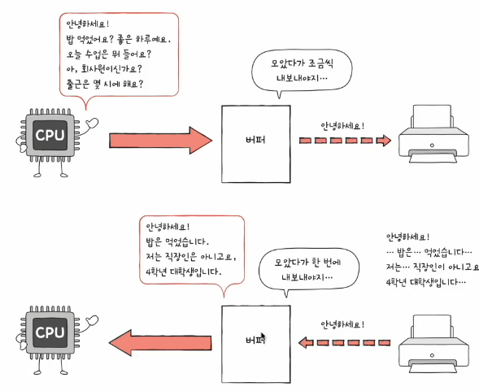
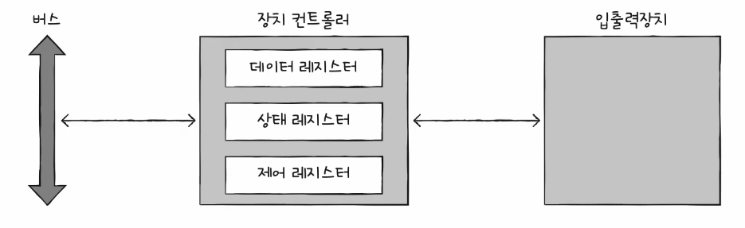
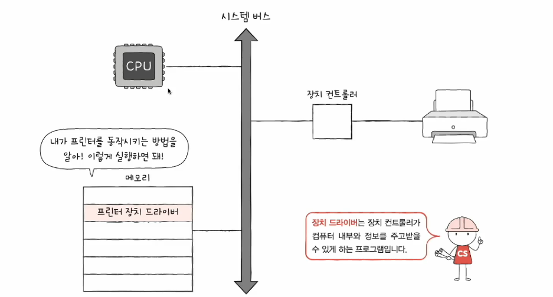

# 01. 장치 컨트롤러와 장치 드라이버
## CPU - 입출력 정보 주고 받기
CPU, 메모리보다 다루기 까다로움  
1. 입출력 장치에 종류가 너무 많음
    - 다양한 만큼 장치맏 속도, 데이터 전송 형식이 다양함
    - 다양한 입출력장치오 정보를 주고받는 방식을 규격화하기 어려움
2. 일반적으로 CPU와 메모리의 데이터 전송률은 높지만 입출력장치의 데이터 전송률은 낮다.
   - 전송율 : 데이터를 얼마나 빨리 교환할 수 있는지를 나타내는 지표

## 장치 컨트롤러
- 하드웨어. 입출력 제어기. 입출력 모듈
- 컴츄터 내부와 정보를 주고 받음. 입출력장치와 컴퓨터를 연결

### 역할
- CPU와 입출력장치 간의 통신중개 : 번역가 역할 수행
- 오류 검출
- 데이터 버퍼링
  - 버퍼링 : 전송률이 높은 장치와 낮은 장치 사에 주고받는 데이터를 버퍼라는 임시 저장 공간에 저장하여 전송률을 비슷하게 맞추는 방법
  - 

### 구조
- 장치 컨트롤러는 시스템 버스와 연결되어 작동
- 데이터 레지스터
  - CPU와 입출력장치 사이에 주고받을 데이터가 담기는 레지스터(버퍼)
  - RAM을 사용하기도 
- 상태 레지스터
  - 상태 정보 저장
    - 입출력장치가 입출력 작업을 할 준비가 되었는지
    - 입출력 작업이 완료되었는지
    - 입출력자이체 오류는 없는지 등의 상태 정보
- 제어 레지스터
  - 입출력장치가 수행할 내용에 대한 제어 정보

## 장치 드라이브
 

- 장치 컨트롤러의 동작을 감지하고 제어하는 프로그램
- 장치 컨트롤러가 컴퓨터 내부와 정보를 주고받을 수 있게 하는 프로그램
- 설치되어 있지 않으면 해당 입출력장치 사용할 수 없음
- 장치 컨트롤러: 입출력장치를 연결하기 위한 하드웨어적 통로
- 장치 드라이브: 입출력장치를 연결하기 위한 소프트웨어적 통로
- 컴퓨터가 연결된 장치의 드라이버를 인식하고 실행할 수 있다면 컴퓨터 내부와 정보를 주고받을 수 있음