# 02. 다양한 입출력방법
## 프로그램 입출력
- 프로그램 속 명령어로 입출력장치를 제어하는 방법
- 입출력 명령어로써 장치 컨트롤러와 상호작용
- CPU가 **장치 컨트롤러의 레지스터** 값을 읽고 씀으로써 이루어진다!
### 메모리에 저장된 정보를 하드 디스크에 백업하는 과정
- 하드 디스크에 새로운 정보 쓰기
1. CPU는 하드 디스크 컨트롤러의 제어 레지스터에 쓰기 명령 내보내기

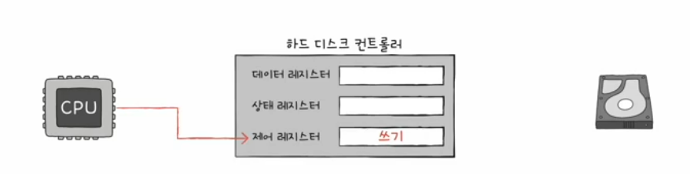

2. 하드 디스크 컨트롤러는 하드 디스크 상태 확인 -> 상태 레지스터에 준비 완료 표시

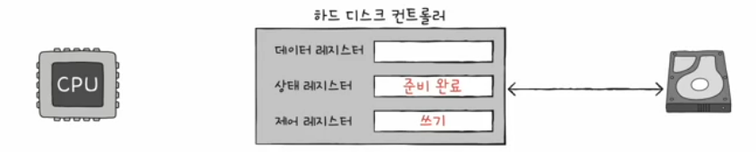

3-1. CPU는 상태 레지스터를 주기적으로 읽어보며 하드 디스크의 준비 여부를 확인  
3-2. 하드 디스크가 준비 되었다면 백업할 메모리의 정보를 데이터 레지스터에 쓰기

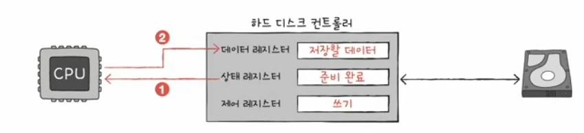

프로그램 입출력 방식 : 메모리 맵 입출력 & 고립형 입출력

### 메모리 맵 입툴력
- 메모리에 접근하기 위한 주소 공간과 입출력장치에 접근하기 위한 주소 공간을 하나의 주소 공간으로 간주하는 방법

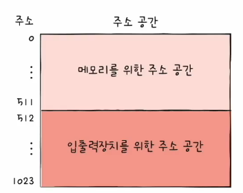

### 고립형 입출력
- 메모리를 위한 주소 공간과 입출력 장티를 위한 주소 공간을 분리하는 방법
- (입출력 읽기/쓰기 선을 활성화시키는) 입출력 전용 명령어 사용

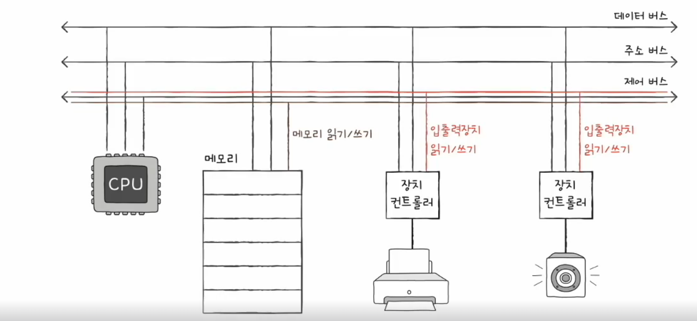

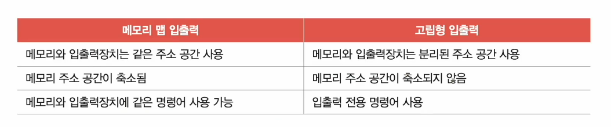

## 인터럽트 기반 입출력
- 하드웨어 입터럽트는 장치 컨트롤러에 의해 발생 -> 사이클을 효율적으로 관리 가능

### 동시다발적인 인터럽트 : 입출력장치가 많을 때
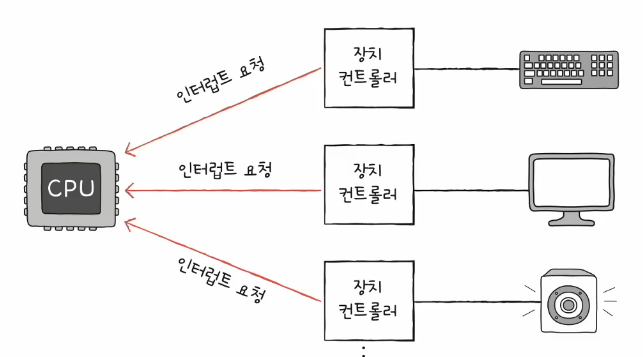
- 발생 순서대로 처리
  - 플래그 레지스터 속 인터럽트 비트를 비활성화한채 인터럽트를 처리하는 경우
  - 인터럽트 중에섣 더 우선 순위가 높은 인터럽트가 있다.
- 우선순위를 반영한 인터럽트
  - NMI가 발생한 경우 플래그 레지스터 속 인터럽트 비트를 활성화한 채 인터럽트를 처리하는 경우
  - PIC(Programmable Interrupt Controller)
  - 1. 여러 장치 컨트롤러에 견결되어
  - 2. 장치 컨트롤러의 하드웨어 인터럽트의 우선순위를 판단한 뒤
  - 3. CPU에게 지금 처리해야 하는 인ㅌ럽트가 무엇인지 판단하는 하드웨어
  - 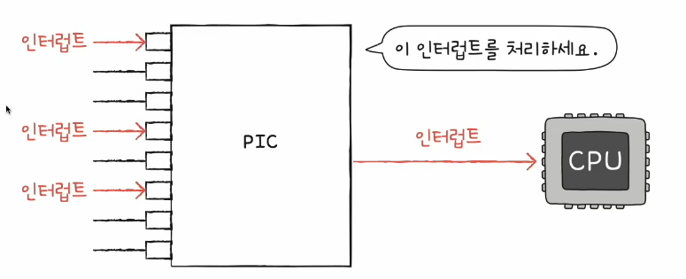

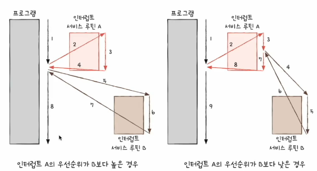

## DMA 입출력
### 프로그램 입출력, 인터럽트 기반 입출력의 공통점 
- 입출력장치와 메모리 간의 데이터 이동은 CPU가 주도하고 이동하는 데이터도 반드시 CPU를 거친다
- 입출력장치의 데이터를 메모리에 저장하는 경우
  - 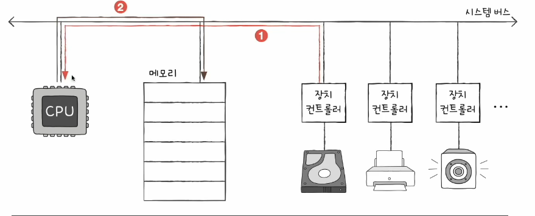  
- 메모리의 데이터를 입출력에 저장하는 경우
  - 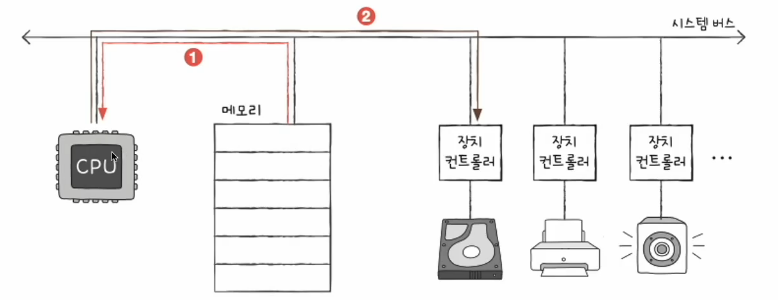

### DMA(Direct Memory Access)
- CPU를 거치지 않고 입출력장치가 메모리에 직접적으로 접근하는 기능
- CPU는 입출력 작업의 시작과 끝만 관여

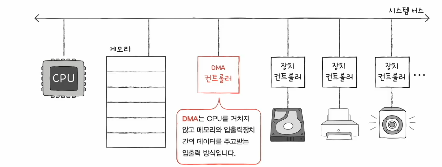

#### DMA 입출력 과정
1. CPU는 DMA 컨트롤러에 입출력 작업을 명령

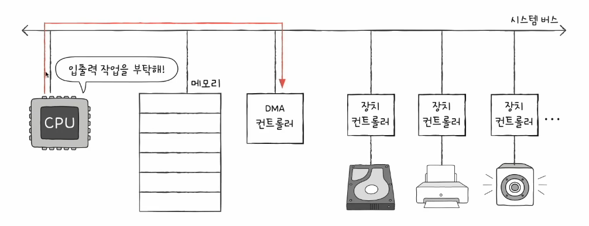

2. DMA 컨트롤러는 CPU 대신 장치 컨트롤러와 상호작용하며 입출력 작업을 수행 (DMA 컨트롤러는 필요한 경우 메모리에 직접 접근)

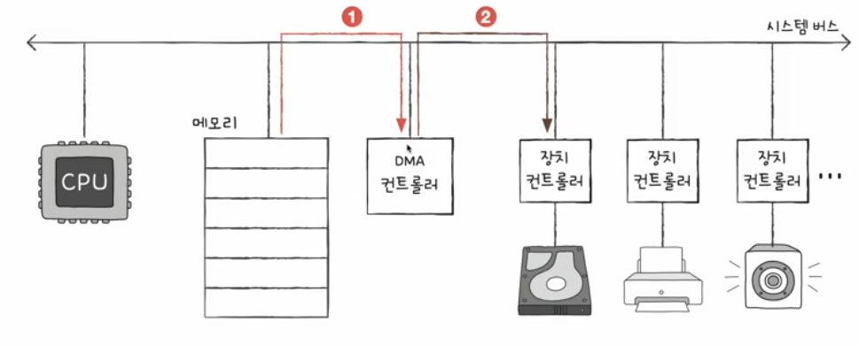

3. 입출력 작업이 끝나면 DMA 컨트롤러는 인터럽트를 통해 CPU에 작업이 끝났음을 알림

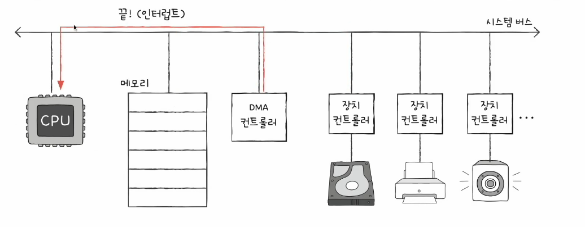

문제점  
- DMA 과정에서 시스템 버스 사용 -> 시스템 버스 공용 자원이라 동시 사용이 불가능
- CPU가 시스템 버스 사용시 DMA 컨트롤러는 시스템 버스를 사용할 수 없고, 반대의 경우도 마찬가지

해결 방안  
1. CPU가 시스템 버스를 이용하지 않을 때마다 조금씩 시스템 버스 이용
2. CPU가 일시적으로 시스템 버스를 이용하지 않도록 허락을 구하고 시스템 버스 이용 -> Cycle stealing

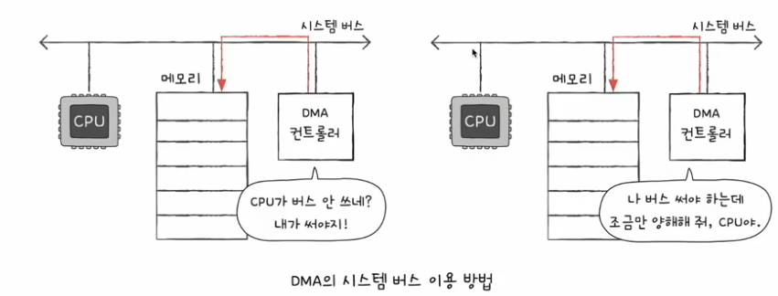

### 입출력 버스
- 입출력 버스를 통해 시스템 버스의 이용 빈도를 낮춤 !!
- PCI버스, PCI express (PCIe) 버스와 입출력 장치를 연결짓는 슬롯
- 슬롯 -> 입출력 버스 -> 시스테 버스

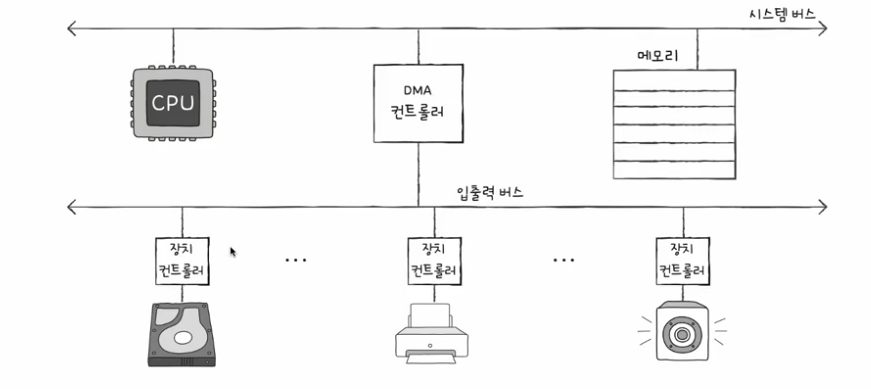