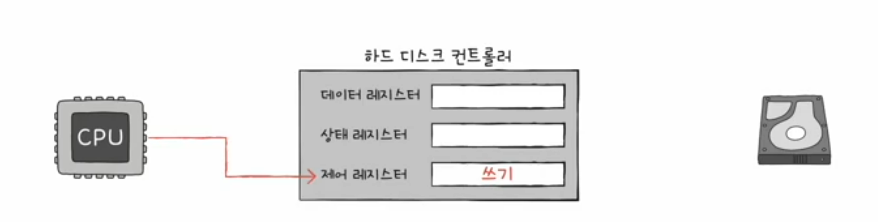
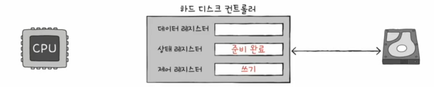
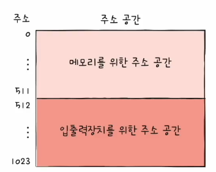
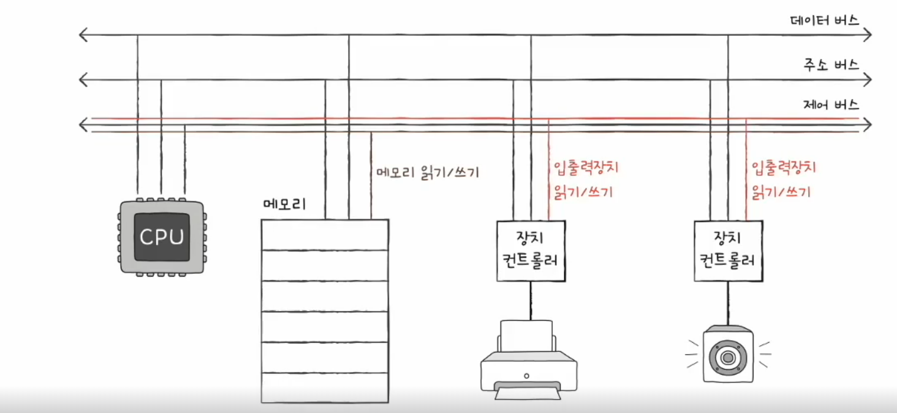
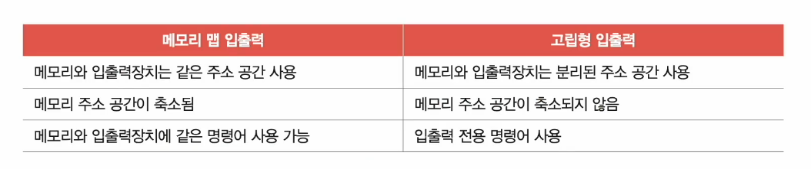

# 02. 다양한 입출력방법
## 프로그램 입출력
- 프로그램 속 명령어로 입출력장치를 제어하는 방법
- 입출력 명령어로써 장치 컨트롤러와 상호작용
- CPU가 **장치 컨트롤러의 레지스터** 값을 읽고 씀으로써 이루어진다!
### 메모리에 저장된 정보를 하드 디스크에 백업하는 과정
- 하드 디스크에 새로운 정보 쓰기
1. CPU는 하드 디스크 컨트롤러의 제어 레지스터에 쓰기 명령 내보내기

2. 하드 디스크 컨트롤러는 하드 디스크 상태 확인 -> 상태 레지스터에 준비 완료 표시

3-1. CPU는 상태 레지스터를 주기적으로 읽어보며 하드 디스크의 준비 여부를 확인  
3-2. 하드 디스크가 준비 되었다면 백업할 메모리의 정보를 데이터 레지스터에 쓰기

프로그램 입출력 방식 : 메모리 맵 입출력 & 고립형 입출력

### 메모리 맵 입툴력
- 메모리에 접근하기 위한 주소 공간과 입출력장치에 접근하기 위한 주소 공간을 하나의 주소 공간으로 간주하는 방법

### 고립형 입출력
- 메모리를 위한 주소 공간과 입출력 장티를 위한 주소 공간을 분리하는 방법
- (입출력 읽기/쓰기 선을 활성화시키는) 입출력 전용 명령어 사용

## 인터럽트 기반 입출력
- 하드웨어 입터럽트는 장치 컨트롤러에 의해 발생

## DMA 입출력