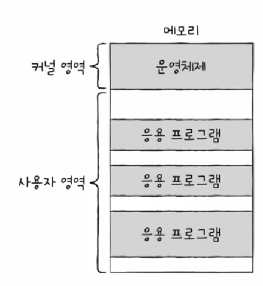
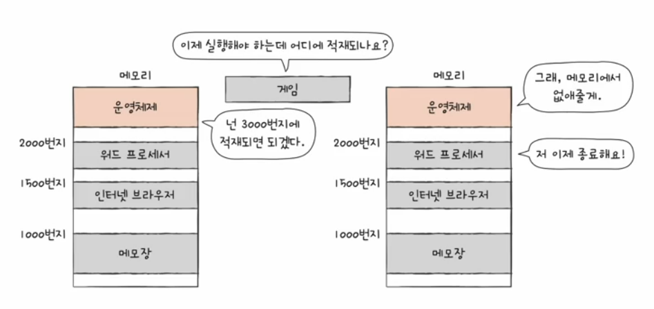
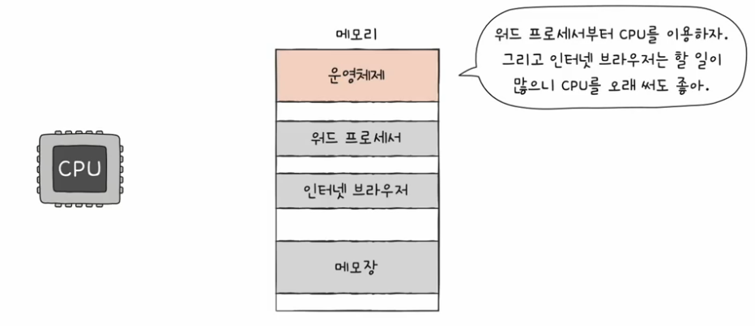
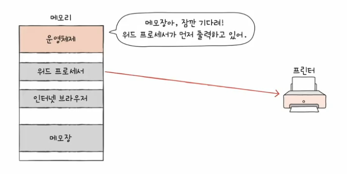

# 01. 운영체제를 알아야 하는 이유
## 운영체제
- 실행할 프로그램에 필요한 **자원을 할당**하고 프로그램이 **올바르게 실행**되도록 돕는 **픅별한 프로그램**
- 커널 열역에 적재되는 프로그램
  - 
  - 응용 프로그램 : 사용자가 특정 목적을 위해 사용하는 일반적인 프로그램
- 모든 프로그램은 실행을 위해 자원(시스템 자원)을 필요로 한다.
- 자원
  - 프로그램 실행에 있어서 마땅히 필요한 요소들
  - 컴퓨터의 네 가지 핵심 부품 포람

운영체제의 메모리 관리  

운영체제의 CPU 관리 - 아주 빠르게 번갈아 실행중. 누구부터? 오래? 등을 정함    

운영체제의 입출력장치 관리  

운영체제는 하드웨어와 응용 프로그램 사이의 연결 다리와 같은 역할 !!  
우리는 얘 덕분에 하드웨어를 조작하는 코드를 직접 작성하지 않아도 된다.

- 운영 체제는 프로그램을 위한 프로그램 !! 
  - 프로그램 만드는 개발자는 운영체제를 잘 알아두어야 한다.
- 문제 해결 능력 
  - 오류 메세지에 대한 깊은 이해

