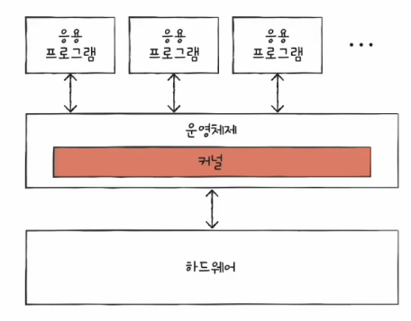
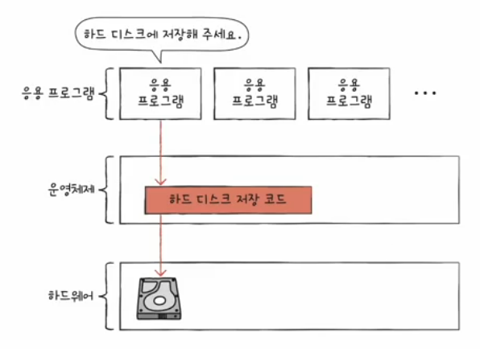
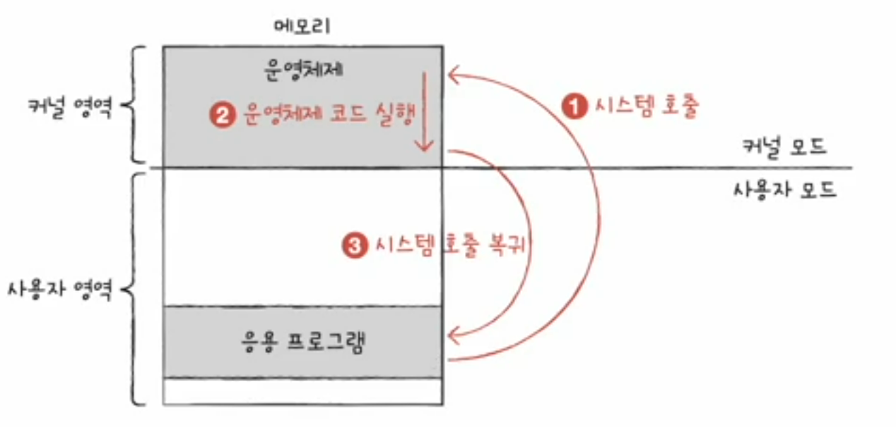
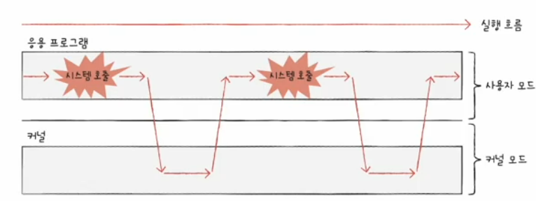

# 02. 운영체제의 큰 그림
## 커널. 운영체제의 심장
- 운영체제는 현존하는 프로그램 중 규모가 가장 큰 프로그램 중 하나
- 다양한 종류의 운영체제 존재
- 운영체제가 제공하는 기능은 다양하지만 **가장 핵심적인 서비스** 존재
- 운영체제 -> 대부분 커널을 의미

**커널(kernel) : 운영체제의 핵심 기능을 담당**  

- 유저 인터페이스(UI)
  -  운영체제에 속하는데 커널에 속하지 않는 기술
  - 사용자와 컴퓨터 간의 통로일 뿐 운영채제의 핵심 기능은 아님

## 이중모드와 시스템 호출
- 사용자가 실행하는 프로그램은 자원에 직접 접근할 수 없음 -> 위험!
- 운영체제는 응용 프로그램이 자원에 접근하려 할 때 오직 자신을 통해서만 접근하도록 하여 자원을 보호 -> 문지기
- 응용 프로그램이 자원에 접근하려면 운영체제에 도움을 요청(=운영체제의 코드를 실행)해야
  - 응용 프로그램이 하드 디스크에 접근할 때 -> 이중 모드로 구현
  - 

### 이중모드
- CPU가 명령어를 실행하는 모드를 크게  **사용자 모드**와 **커널 모드**로 구분하는 방식
- 사용자 모드
  - 운영체제 서비스를 제공받을 수 없는 실행 모드
  - 커널 영역의 코드를 실행할 수 없는 실행 모드
  - 자원 접근 불가
- 커널 모드
  - 운영체제의 서비스를 제공받을 수 있는 실행 모드
  - 자원 접근을 비롯한 모든 명령어 실행 가능
  - 플래그 레지스터 속 슈퍼바이저 플래그가 1인 경우 커널 모드 실행중임!!

### 시스템 호출
- 운영체제 서비스를 제공받기 위해 커널모드로 전환하는 방법
- 커널 모드로 전환하여 실행하기 위해 호출
- 일종의 소프트웨어 입터럽트
  - 시스템 호출이 처리되는 방식은 하드웨어 인터럽트 처리 방식과 유사

  

## 운영체제의 핵심 서비스
- 프로세스 관리
  - 프로세스 == 실행 중인 프로그램
  - 수많은 프로세스들이 동시에 실행
  - 동시다발적으로 생성/실행/삭제되는 다양한 프로세스를 일목요연하게 관리
    - 프로세스와 스렏 프로세스 동기화, 교착상태 해결
- 자원 접근 및 할당
  - CPU : CPU 스케쥴링 -> 어떤 프로세스를 먼저, 얼마나 오래 실행할까?
  - 메모리 : 페이징, 스와핑 등
  - 입출력 장치
- 파일 시스템 관리
  - 관련된 정보를 파일이라는 단위로 저장 장치에 보관
  - 파일들을 묶어 폴더(디렉터리) 단위로 저장 장치에 보관