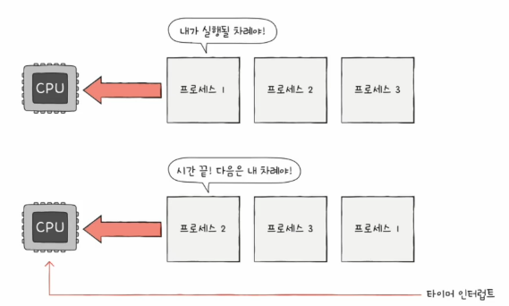
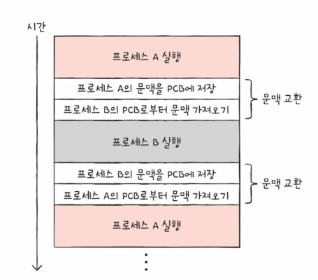
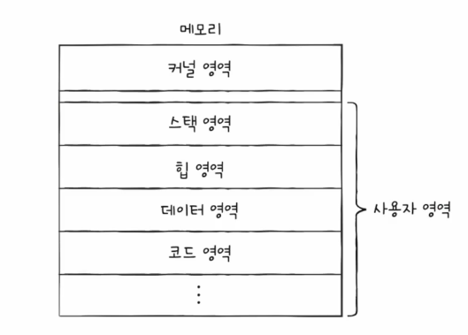
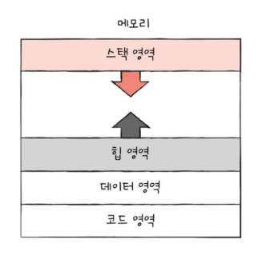

# 01. 프로세스 개요
프로그램 실행 -> 프로세스 생성

## 프로세스 직접 확인하기
- 윈도우 : 작업 관리자
- 포그라운드 프로세스 (foreground process)
  - 사용자가 볼 수 있는 공간에서 실행되는 프로세스
  - 웹브라우저, 메모장, 워드 프로세스 등
- 백그라운드 프로세스 (background process)
  - 사용자가 볼 수 없는 고간에서 실행되는 프로세스
    - 사용자와 직접 상호작용이 가능한 백그라운드 프로세스
    - 사용자와 상호작용하지 않고 그저 정해진 일만 수행하는 프로세스 : 데몬, 서비스

## 프로세스 제어 블록
- 프로세스들은 돌아가며 한정된 시간만큼만 CPU 이용
  - 자신의 차례에 정해진 시간만큼 CPU 이용
  - 타이머 인터럽트가 발생하면 차례 양보 : 클럭 신호를 발생시키는 장치에 의해 주기적으로 발생하는 하드웨어 인터럽트

- 프로세스 제어 블록(PCB) : 빠르게 번갈아 수행되는 프로세스들을 관리하기 위해 사용하는 자료구조
  - 프로세스 관련 정보를 저장하는 자료 구조
  - 상품에 달린 태그와 같은 정보
  - 프로세스 생성 시 커널 영역에서 생성, 종료 시 폐기
- 운영 체제는 커널 영역에서 적재된 PCB를 보고 프로세스를 관리함
- PCB에 담기는 대표적인 정보
  - 프로세스 ID (=PID)
    - 특정 프로세스를 식별하기 위해 부여하는 고유한 번호 (학교의 학번)
  - 레지스터 값
    - 프로세스는 자신의 실행 차례가 오면 이전까지 사용한 레지스터 중간 값을 모두 복원 -> 실행 재개
    - 자기 차례가 돌아오면 실행을 재개하기 위함
    - 프로그램 카운터, 스택 포인터 등
  - 프로세스 상태
    - 입출력 장치를 사용하기 위해 기다리는 상태, CPU를 사용하기 위해 기다리는 상태, CPU 이용중인 상태 등..
  - CPU 스케줄링 정보
    - 프로세스가 언제, 어떤 순서로 CPU를 할당받을지에 대한 정보
  - 메모리 정보
    - 프로세스가 어느 주소에 저장되어 있는지에 댕한 정보
    - 페이지 테이블 정보 (메모리 주소를 알 수 있는 정보)
  - 사용한 파일과 입출력 장치 정보
    - 할당된 입출력 장치, 사용 중인 파일 정보

+) 자료 구조
- 자료를 저장하는 하나의 형태

## 문맥 교환 (context switch)
- 기존의 실행 중인 프로세스 문맥을 백업하고 새로운 프로세스 실행을 위해 문맥을 복구하는 과정
  - 여러 프로세스가 끊임없이 빠르게 번갈아가며 실행되는 원리
- 한 프로세스에서 다른 프로세스로 실행 순서가 넘어가면 ?
- 기존에 실행되는 프로세스 A는 지금까지의 **중간 정보**를 백업
  - 프로그램 카운터 등 각종 레지스터 값, 메모리 정보, 열었떤 파일, 사용한 입출력 장치 등
  - **문맥(context)** == 이러한 중간 정보
  - 다음 차례가 왔을 때 실행을 재개하기 위한 정보
  - **실행 문맥을 백업해두면 언제든 해당 프로세스의 실행을 재개할 수 있다.**
- 뒤이어 실행할 프로세스 B의 문맥을 복구
  - 자연스럽게 실행 중인 프로세스가 바뀜

## 프로세스의 메모리 영역
- 사용자 영역의 프로세스 저장
- 코드 영역(=텍스트 영역), 데이터 영역, 힙 영역, 스택 영역

- 코드 영역 (= 텍스트 영역)
  - 실행할 수 있는 코드. 기계어로 이루어진 명령어 저장
  - 데이터가 아닌 CPU가 실행할 명령어가 담기기에 쓰기가 금지된 영역 (read-only)
  - 크기가 변하지 않음 (크기 고정) -> 정적 할당 영역
- 데이터 영역
  - 잠깐 썻다가 없앨 데이터가 아닌 프로그램이 실행되는 동안 유지할 데이터 저장
  - e.g. 전역 변수
  - 크기가 변하지 않음 (크기 고정) -> 정적 할당 영역
- 힙 영역
  - 프로그램을 만드는 사용자, 즉 프로그래머가 직접 할당할 수 있는 저장 공간
  - 이 영역은 반환해야함 -> 가비지 컬렉션이 해줌
  - 크기가 변함 -> 동적 할당 영역
- 스택 영역
  - 데이터가 일시적으로 저장되는 공간
  - 잠깐 쓰다가 말 값들이 저장도는 공간
  - e.g. 매개 변수, 지역 변수
  - 크기가 변함 -> 동적 할당 영역
- 힙 영역과 스택 영역의 크기는 가변적
  - 일반적으로 힙 영역은 낮은 주소 -> 높은 주소로 할당
  - 일반적으로 스택 영역은 높은 주소 -> 낮은 주소로 할당
  - 