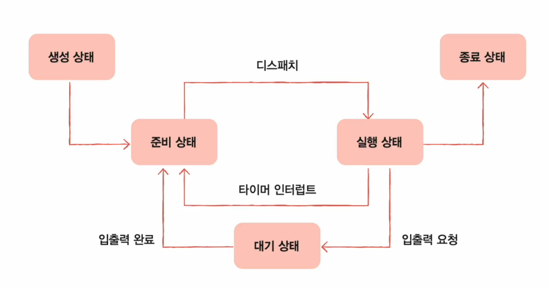
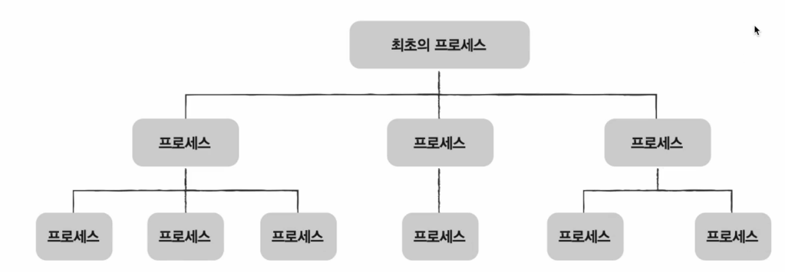
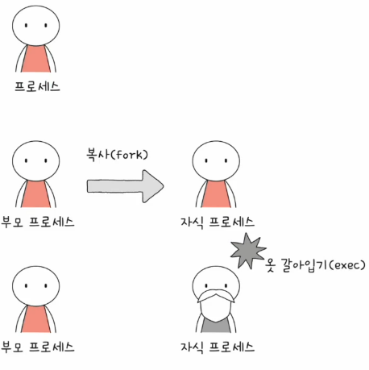
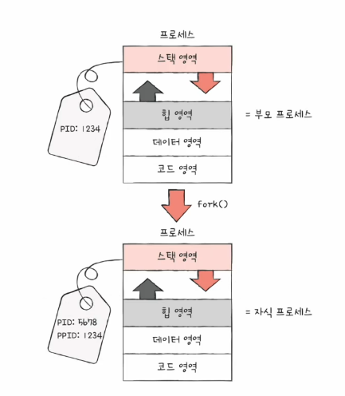
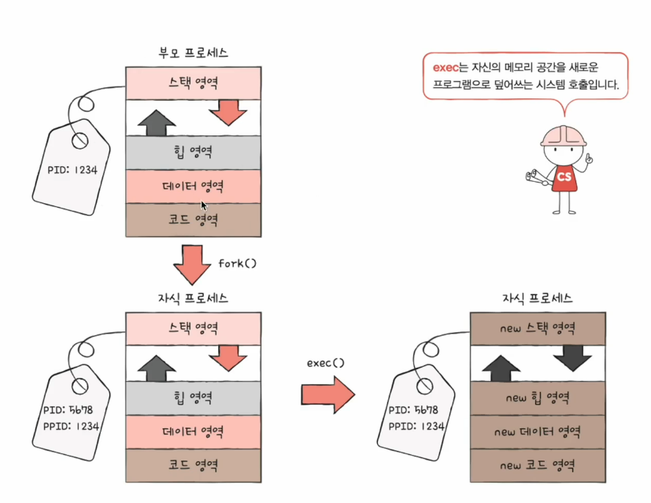

# 02. 프로세스 상태와 계층 구조
## 프로세스 상태
- 생성 상태
  - 이제 막 메모리에 적재되어 PCB를 할당 받은 상태
  - 준비가 완료되었다면 준비 상태로
- 준비 상태
  - 당장이라도 CPU를 할당 받아 실핼할 수 있지만 자신의 차례가 아니어 기다리는 상태
  - 자신의 차례가 된다면 실행 상태로 (=디스패치)
- 실행 상태
  - CPU를 할당 받아 실행 중인 상태
  - 할당된 시간 몯 사용 시 (다이머 인터럽트 발생 시) 준비 상태로
  - 실행 도중 입출력장티를 사용하면 입출력 작업이 끝날 때까지 대기 상태로
- 대기 상태
  - 프로세스가 실행 도중 입출력장치를 사용하는 경우
  - 입출력 작업은 CPU에 비해 느리기에 이 경우 대기상탤 접어듬
  - 입툴력 작업이 끝나면 (입출력 완료 인터럽트를 받으면) 준비 상태로
- 종료 상태
  - 프로세스가 종료된 상태
  - PCB, 프로세스의 메모리 영역 정리

## 프로세스 계층 구조
- 프로세스 실행 도중 (시스템 호출을 통해) 다른 프로세스 생성 가능
- 새 프로세스를 생성한 프로세스 : 부모 프로세스
- 부모 프로세스에 의해 생성된 프로세스 : 자식 프로세스
- 자식 프로세스가 또 다른 자식 프로세스를 만들며 **프로세스의 계층적인 구조 형성**

부모 프로세스와 자식 프로세스는 **별 개의 프로세스** 이므로 **각기 다른 PID**를 가짐  
일부 운영 체제에서는 자식 프로세스 PCB에 부모 프로세스 PID(PPID)를 명시하기도

## 프로세스 생성 기법

- 복제와 옷 갈아입기
- 부모 프로세스는 **fork 시스템 호출**을 통해 자신의 복사본을 자식 프로세스로 생성
- 자식 프로세스는 **exec 시스템 호출**을 통해 자신의 메모리 공간을 다른 프로그램으로 교체

### fork 시스템 호출

- 자기 자신 프로세스의 복사본을 자식 프롯스로 생성하는 시스템 호출
- 복사본(=자식 프로세스) 생성
- 부모 프로세스의 자원 상속

### exec 시스템 호출

- 자신의 메모리 공간을 새로운 프로그램으로 덮어쓰는 시스템 호출 
- 메모리 공간을 새로운 프로그램으로 덮어쓰기
- 코드/데이터 영역은 실행할 프로그램 내용으로 바뀌고 나머지 영역을 초기화
