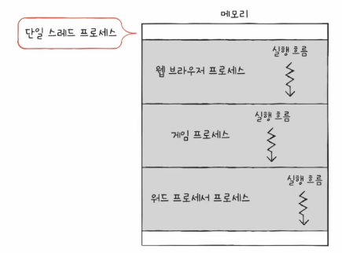
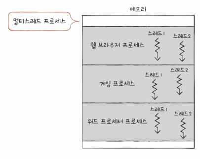
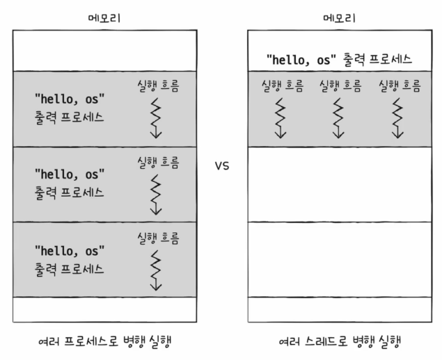

# 03. 스레드
- 스레드(tread) : 프로세스를 구성하는 실행 흐름의 단위
- 하나의 프로세스는 하나 이상의 스레드를 가질 수 있다.

## 프로세스와 스레드
- 단일 스레드 프로세스 : 실행 흐름이 하나인 프로세스
  - 
- 멀티 스레드 프로세스 : 실행 흐름이 여러개인 프로세스
  - 프로세스를 이루는 여러 명령어 동시 실행 가능
  - 

- 스레드의 구성 요소
  - **실행에 필요한 최소한의 정보**
  - 스레드 ID, 프로그램 카운터를 비롯한 레지스터 값, 스택 등
  - 프로세스를 이루는 스레드들은 프로세스의 자원을 공유할 수 있음

## 멀티 프로세스와 멀티 스레드
- 동일한 작업을 수앵하는 단일 스레드 프로세스 여러 개 실행 VS 하나의 프로세스를 여러 스레드로 실행
- 차이점 : 자원 공유 여부 -> 스레드끼리는 자원 공유를 하지 않음
- 프로세스는 독립적으로 실행. 자원 공유하지 않음
  - 프로세스 간에도 자원을 주고 받을 수 있음 : 프로세스 간 통신 (IPC)
  - 파일을 통한 프로세스 간 통신, 공유 메모리를 통한 프로세스 간 통신
- 스레드 자원 공유 -> 협력과 통신에 유리
  - 자원 공유로 인한 문제가 발생할 수 있음

### 멀티 프로세스
- 프로세스를 fork하면 코드/데이터/힙 영역 등 모든 자원이 복제되어 저장됨
- 저장된 메모리 주소를 제외하면 모든 것이 동일한 프로세스 두개가 통째로 메모리에 적재
- fork를 세번 네번 하면 메모리에는 같은 프로세스가 세 개 내개 적재
- 참고
  - fork 직후 같은 프로세스를 **통째로 메모리에 중복 저장하지 않으면서** 동시에 프로세스끼리 자원 공유하지 않는 방법
  - 쓰기식 복사(copy on write) 기법

### 멀티 스레드
- 스레드들은 각기 다른 스레드 ID. 
- (별도의 실행을 위해 꼭 필요한) 프로그램 카운터 값을 포함한 레지스터 값, 스택을 가질 뿐
- 프로세스가 가지는 자원을 공유

