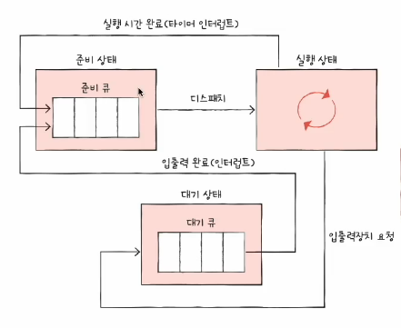
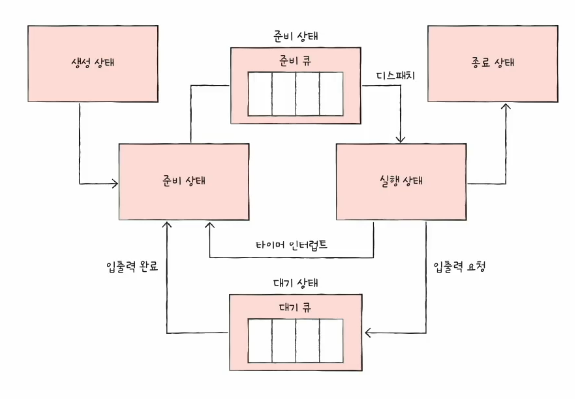

# 01. CPU 스케줄링 개요
- 운영체제가 프로세스들에게 공정하고 합리적으로 CPU 자원을 배분하는 것

## 프로세스 우선순위(priority)
- 입출력 작업이 많은 프로세스(=입출력 집중 프로세스. IO bound 프로세스) >> CPU 작업이 많은 프로세스(=CPU 집중 프로세스. CPU bound 프로세스)
- 입출력 집중이 대기 비교적 대기 상태에 더 많이 머뭄 -> 빠리 처리해서 CPU 집중 프로세스에 집중적으로 할당 가능

### 스케줄링 큐
- 특정 자원을 이용하고 싶어하는 프로세스들을 큐에 삽입해 자원 이용하도록 하는 것
- 반드시 선입선출 방시일 필요는 없음
- 같은 큐 내에서도 우선순위 별로 처리

#### 준비 큐와 대기 큐  

준비 큐  
- CPU를 이용하기 위해 기다리는 줄

대기 큐  
- 입출력장치를 이용하기 위해 기다리는 줄
- 같은 장치를 요구한 프로세스들은 같은 큐에서 대기

### 프로세스 상태 다이어그램

#### 선점형과 비선점형 스케줄링

- 선점형 스케줄링 : 현재 CPU를 사용 중인 프로세스로부터 CPU 자원을 빼앗아 다른 프로세스에 할당
  - 장점 : 어느 한 프로세스의 자원 독점을 막고 프로세스들에 골고루 자원을 배분할 수 있다.
  - 단점 : 그만큼 문맥 교환 과정에서 오버헤드가 발생할 수 있다.
- 비선점형 스케줄링 : 현재 CPU를 사용 중인 프로세스의 작업이 끝날 때까지 프로세스 기다리기
  - 장점 : 선점형 스케줄링에 비행 문맥 교환에서 발생하는 오버헤드가 적다
  - 모든 프로세스가 골고루 자원을 이용하기 어렵다.
