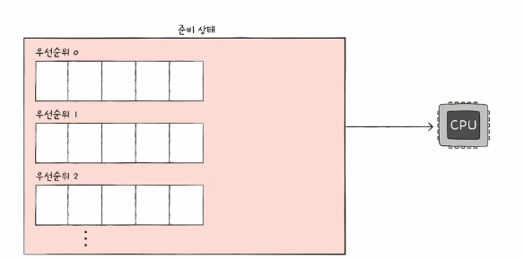

# 02. CPU 스케줄링 알고리즘
## 1. 선인 선처리 스케줄링

- FCFC (First Come First Served) 스케줄링
- 단수히 준비 큐에 삽입된 순서대로 처리하는 비선점 스케줄링
- 먼저 CPU를 요청한 프로세스부터 CPU 할당
- 단점 : 프로세스들이 기다리는 시간이 매우 길어질 수 있다는 부작용 (=호위 효과)

## 2. 최단 작업 우선 스케줄링

- SJF(Shortest Job First) 스케줄링
- 호위 효과 방지
- CPU 사용이 긴 프로세스는 나중에 실행, CPU 사용 시간이 짧은 프로세스는 먼저 실행
- CPU 사용 시간이 가장 짧은 프로세스부터 처리하는 스케줄링 방식

## 3. 라인드 로빈 스케줄링

- RR (Round Robin) 스케줄링
- 선입 선처리 스케줄링 + 타입 슬라이스 (time slice)
- 타임 슬라이스 : 각 프로세스가 CPU를 사용할 수 있는 정해진 시간
- 정해진 타임 슬라이스 만큼의 시간동안 돌아가며 CPU를 이용하는 선점형 스케줄링
  - 큐에 삽입된 프로세스들은 순서대로 CPU를 이용하되 정해진 시간 만큼만 이용
  - 정해진 시간을 모두 사요하였음에도 아직 프로세스가 완료되지 않았따면 다시 큐의 맨 뒤에 삽입 (문맥교환)
- 타임 슬라이스의 크기가 중요

## 4. 최소 잔여 시간 우선 스케줄링
- SRT (Shortest Remaining Time) 스케줄링
- 최단 작업 우선 스케줄링 + 라운드 로빈 스케줄링
- 정해진 시간만큼 CPU를 이용하되, 다음으로 CPU를 사용할 프로세스로는 남은 작업 시간이 가장 적은 프로세스 선택

## 5. 우선순위 스케줄링
- 프로세스들에 우선순위를 부여하고, 우선순위 높은 프로세스부터 실행
- 우선순위가 같은 프로세스들은 선입 선처리로 스케줄링
- 최단 작업 우선 스케줄링, 최소 잔여시간 스케줄링이 우선순위 크세줄링에 포함된다.
- 우선순위 스케줄링의 근본적인 문제점 : 기아(starvation) 현상
  - 우선순위 높은 프로레스만 실행하다보면 우선순위 낮은 프로세스들은 계속해서 실행 연기
  - 
- 에이징(aging) : 기아현상 방지
  - 오랫동안 대시한 프로세스의 우선순위를 점차 높이는 방식
  - 대시 중인 프로세스의 우선순위를 마치 나이 먹듯 점차 증가시키는 방법 -> 언젠가는 우선 순위가 높아짐
  - 

## 6. 다단계 큐 스케줄링
- Multilevel queue 스케줄링
- 우선순위 스케줄링의 발전된 형태
- 우선순위별로 준비큐를 여러 개 사용하는 스케줄링 방식
  - 우선순위가 가장 높은 큐에 있는 프로세스를 먼저 처리
  - 우선순위가 가장 높은 큐가 비어있으면 그 다음 우선순위 큐에 있는 프로세스 처리

## 7. 다단계 피드백 큐 스케줄링
- Multilevel feedback queue 스케줄링
- 다단계 큐 스케줄링의 발전된 형태
- 큐 간의 이동이 가능한 다단계 큐 스케줄링
- 다단계 큐 스케줄링에서는 기본적으로 큐 간의 이동 불가
  - 우선순위 낮은 프로세스는 계속해서 실행 연기 우려
  - 기아 현상 발생 가능

- CPU 집중 프로세스일수록 우선순위가 자연스럽게 낮아지고 입출력 집중 프로세스 일수록 우선순위가 높아짐
- 다단계 피드백 큐에서 에이징 기법 적용할 수 있음
- 즉, 어떤 프로세스의 CPU 시간이 길면 우선순위가 낮아지고 어떤 프로세스가 낮은 우선순위 큐에서 너무 오래 기다리면 우선순위를 높이는 방식
- CPU 스케줄링 방식으로 알려져 있음

