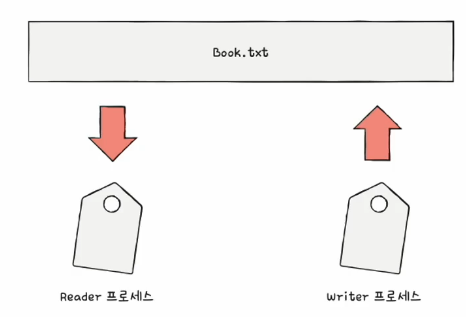
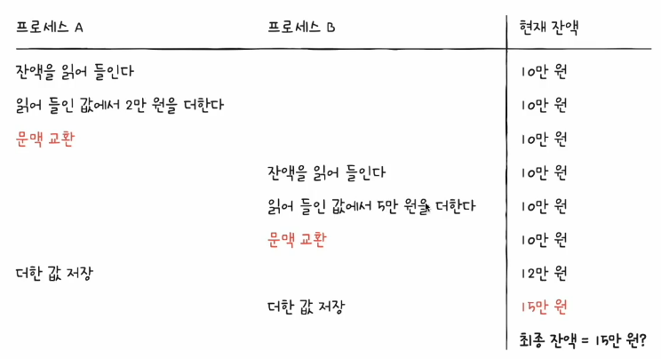
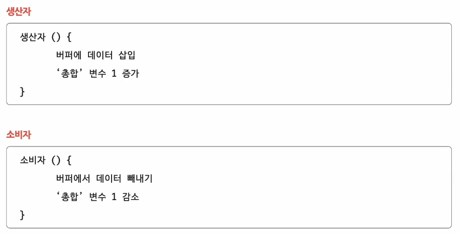
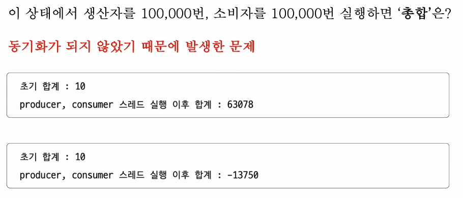
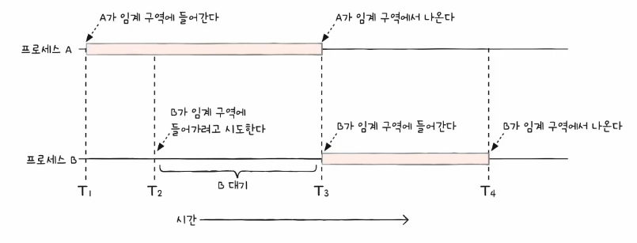
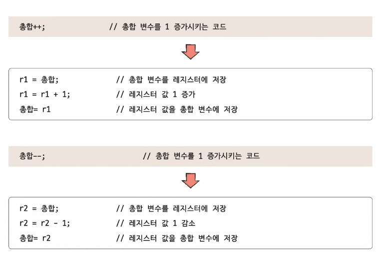

# 01. 동기화란
- 동시다발적으로 실행되는 프로세스들은 서로 협력하여 영향을 주고 받음 -> 자원의 일관성을 보장해야 함 : 동기화

## 동기화의 의미
- 올바른 수행을 위해 프로세스들은 동기화 되어야 한다!!
- 동기화 : 프로세스들의 수행 시기를 맞추는 것
  - 실행 순서 제어 : 프로세스를 올바른 순서대로 실행하기
  - 상호 배제: 동시에 접근해서는 안되는 자원에 하나의 프로세스만 접근하게 하기
- 실행의 문맥을 갖는 모든 대상은 동기화 대상 -> 스레드도 동기화 대상임!!
- 예) 공동의 목적을 위해 동시에 수행되는 프로세스
  - e.g. 워드 포르세서 프로그램의
    - 맞춤법 검사 프로세스
    - 입력 내용을 화면에 출력하는 프로세스

### 실행 순서 제어를 위한 동기화 : reader writer problem  

- Writer : Book.txt 파일에 값을 저장하는 프로세스
- Reader : Book.txt 파일에 저장된 값을 읽어들이는 프로세스
- **실행의 순서가 존재** -> Reader와 Writer 프로세스는 무작정 아무렇게나 실행되면 X
- Reader 프로세스는 "Book.txt 안에 값이 존재한다"는 **특정 조건이 만족되어야만** 실행 가능

### 상호 배제를 위한 동기화 : Bank account problem
- **한번의 하나의 프로세스만 접근해야하는 자원**의 동시 사용을 피하기 위한 동기화
- 현재 계좌 잔액 : 10만원
  - 프로세스 A : 읽어들인 잔액에서 2만원을 더하고 저장한다.
  - 프로세스 B : 읽어들인 잔액에서 %만원을 더하고 저장한다.

- A가 마치기전에 B가 접근하면 예상치 못한 결과가 발생할 수 있음

### 상호 배제를 위한 동기화 : Producer & consumer problem
- 물건을 계속해서 생상하는 생산자 (producer, 프로세스 혹은 스레드)
- 물건을 계속해서 소비하는 소비자 (consumer, 프로세스 혹은 스레드)
- '총합' 변수 공유

## 공유 자원과 임계 구역
- 공유 자원 : 여러 프로세스 혹은 스레드가 공유하는 자원. 공동으로 이용하는 변수, 파일, 장치 등의 자원
  - 전역 변수, 파일, 입툴력장치, 보조기억장치
- 임계 구역 : 동시에 실행되는 문제가 발생하는 자원에 접근하는 코드 영역. 유 자원에 접근하는 코드 중 동시에 실행하면 문제가 발생하는 코드 영역
  - '총합' 변수, '잔액' 변수
- 임계 구역에 진입학자 하면 진입한 프로세스 이외에는 대기해야 한다

- 레이스 컨디션 (race condition) : 임계 구역에 동시에 접근하면 자원의 일관성이 깨질 수 있다.

- 고급언어 -> 저급언어 여러줄로 변환되어 실행
- 저급언어가 실행되는 과정에서 문맥교환이 발생하면 자원의 일관성이 깨질 수 있음 -> 레이스 컨디션이 발생할 수 있다!

#### 운영체제가 임계구역 문제를 해결하는 세 가지 원칙
- 상호 배제를 위한 동기화를 위한 세 가지 원칙
1. 상호 배제 (mutual exclusion) : 한 프로세스가 임계 구역에 진입했다면 다른 프로세스는 들어올 수 없다.
2. 진행 (progress) : 임계 구역에 어떤 프로세스도 진입하지 않았따면 진입하고자 하는 프로세스는 들어갈 수 있어야 한다.
3. 유한 대기 (bounded waiting) : 한 프로세스가 임계 구역에 진입하고 싶다면 언제가는 임계 구역에 들어올 수 있어야 한다.(임계 구역에 들어오기 위해 무한정 대기해서는 안된다.)

