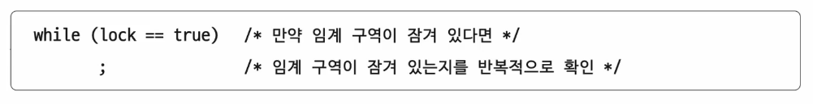

# 02. 동기화 기법
- 동기화 기법 : 뮤텍스 락, 세마포, 모니터

## 뮤텍스 락
- 상포 배제를 위한 동기화 도구(자물쇠 역할). 뮤텍스 락
- 공유자원이 하나만 있는 경우를 상정한 방식

뮤텍스 락의 단순한 형태  
- 전역 변수 하나, 함수 두 개
- 자물쇠 역할 : 프로세스들이 공유하는 전역 변수 lock
- 임계 구역을 잠그는 역할 : acquire 함수
- 임계 구역의 잠금을 해제하는 역할 : release 함수

  

### acquire 함수
- 프로세스가 임계 구역에 진입하기 전에 호출
- 임계 구역이 잠겨 있다면
  - 임계 구역이 열릴 때까지 (lock이 false가 될 때까지) 임계 구역을 반복적으로 확인
- 임계 구역이 열려 있다면
  - 임계 구역을 잠그기 (lock를 true로 바꾸기)

### release 함수
- 임계 구역에서의 작업이 끝나고 호출
- 현재 잠긴 임계 구역을 열기(lock을 fasle로 바꾸기)

#### 바쁜 대기 (busy waiting)
- 끊임없이 확인하는 것
- 좋은 방식은 아님!

## 세마포
- 좀 더 일반화된 방식의 동기화 도구
- 공유자원이 여러 개 있는 경우에도 적용 가능
- 이진 세마포, 카운팅 세마포 등이 있음. 카운팅 세마포가 더 일반적
- 임계 구역 앞에서 멈춤 신호를 받으면 잠시 기다리기
- 임계 구역 앞에서 가도 좋다는 신호를 받으면 임계 구역 진입

세마포의 단순한 형태   
- 전역 변수 하나, 함수 두개
- 임계 구역에 진입할 수 있는 프로세스이 개수(사용 가능한 공유 자원의 개수)를 나타내는 전역 변수 S
- 임계 구역에 들어가도 좋은지, 기다려야 할 지를 알려주는 wait 함수
- 임계 구역 앞에서 기다리는 프로세스에 '이제 가도 좋다'고 신호를 주는 signal 함수

- 예제

#### Busy waiting

- 해결 방법
  - 사용할 수 있는 자원이 없을 경우 대기 상태로 만듦 (해당 프로세스의 PCB를 대기 큐에 삽입)
  - 사용할 수 있는 자원이 생겼을 경우 대기 큐의 프로세스를 준비 상태로 만듦 (해당 프로세스의 PCB를 대기 큐에서 꺼내 준비 큐에 삽입)
- 

### 세마포를 활용한 실행 순서 동기화
- 세마포의 변수 S를 0으로 두고
- 먼저 실행할 프로세스 뒤에 signal 함수
- 다음에 실행할 프로세스 아펭 wait 함수를 붙이면 된다!

## 모니터
- 사용자(개발자)가 다루기 편한 동기화 도구

### 상호 배제를 위한 도익화
- 인퍼테이스를 위한 큐
- 공유자원에 접근하고자 하는 프로세스를 (인터페이스를 위한) 큐에 삽입
- 큐에 삽입된 순서대로 (한 번에 하나의 프로세스만) 공유 자원 이용

