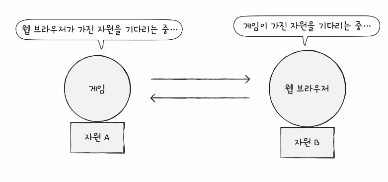
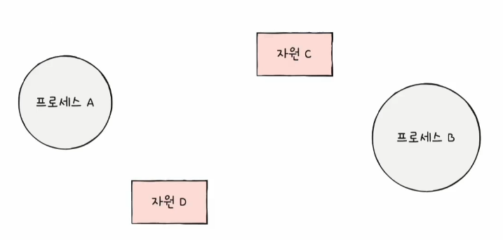
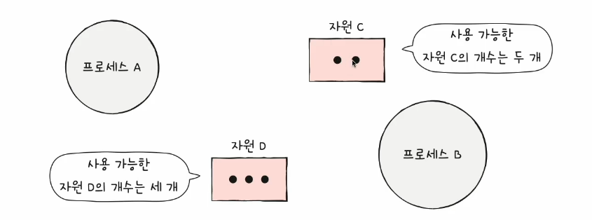
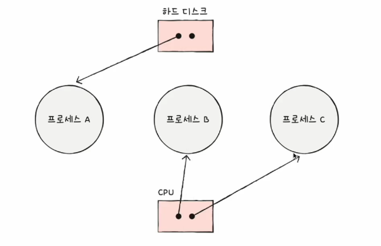
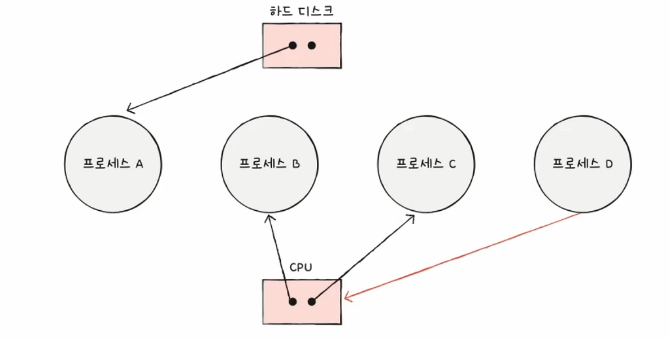
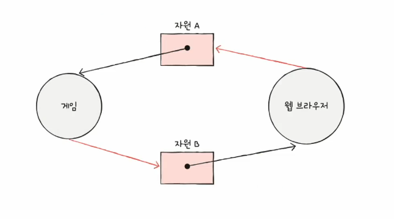

# 01. 교착 상태란
- 일어나지 않을 사건을 기다라며 진행이 멈춰 버리는 현상

교착 상태를 해결하기 위해서는  
1. 교착 상태가 발생했을 때의 상황을 정확히 표현해보기
2. 교착 상태가 일어나는 근본적인 이유 이해하기

## 자원 할당 그래프
- 교착 상태 발생조건 파악 가능
  - 어떤 프로세스가 어떤 자원을 할당 받아 사용 중인지 확인 가능
  - 어떤 프로세스가 어떤 자원을 기다리고 있는지 확인 가능

### 그리는 방법
1. 프로세스는 원, 자원의 종류는 사각형으로 표현

2. 사용할 수 있는 자원의 개수는 자원 사각형 내에 점으로 표현

3. 프로세스가 어떤 자원을 할당 받아 사용 중이라면 자원에서 프로세스를 향해 화살표를 표시

4. 프로세스가 어떤 자원을 기다리고 있다면 프로세스에서 자원으로 화살표를 표시

- 교착 상태가 발생한 자원 할당 그래프의 특징
  - 원의 형태를 띔

## 교착 상태가 발생할 조건
- 네 가지 조건 중 하나라도 만족하지 않으면 교착 상책 발생하지 않음
- 네 가지 조건을 모두 만족하면 교착 상태가 발생할 수 있음

1. 상호 배제 : 한 프로세스가 사용하는 자원을 다른 프로세스가 사용할 수 없는 상태
2. 점유와 대기 : 자원을 할당 받은 상태에서 다른 자원을 할당 받기를 기다리는 상태
3. 비선점 : 어떤 프로세스도 다른 프로세스의 자원을 강제로 빼앗지 못하는 상태
4. 원형 대기 : 프로세스들이 원의 형태로 자원을 대기하는 상태
