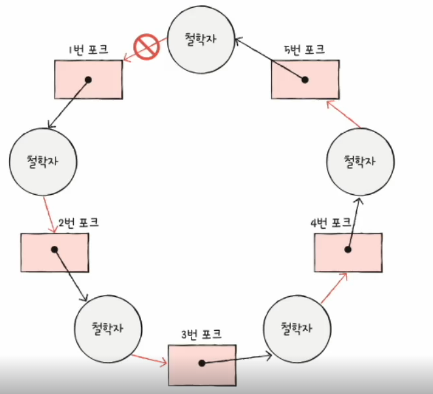
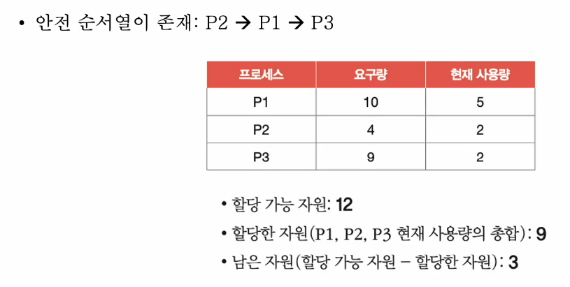

# 02. 교착 상태 해결 방법
- 교착 상태 해결 : 예방, 회피, 검출 후 회복

## 교착 상태 예방
- 애초에 교착 상태가 발생하지 않도록
- 교착 상태 발생 조건 (상호 배제, 점유와 대기, 비선점, 원형 대기) 중 하나 없애 버래기
  - 상호 배제 없애기 - 모든 자원 공유 ? 현실적으로 불가능
  - 점유와 대기 없애기
    - 특정 프로세스에 자원을 모두 할당하거나, 아예 할당하지 않는 반식으로 배분
    - 자원의 활용율을 낮출 수 있는 방식
  - 비선점 조건 없애기
    - 선점이 가능한 자원(cpu)에 한해 효과적
    - 모든 자원이 선점 가능한 것이 아님
  - 원형 대기 조건 없애기
    - 자원에 번호를 붙이고 오름차순으로 할당하면 원형 대기는 발생하지 않음
    - 
    - 자원에 번호 붙이는 것은 어려움 작업
    - 어떤 자원에 어떤 번호를 붙이느냐에 따라 활용율이 달라짐

-> 교착 상태가 발생하지 않음을 보장할 수 있으나 부작용이 따르는 방식

## 교착 상태 회픠
- 교착 상태를 **무분별한 자원 할당으로 인해 발생** 했다고 간주
- 교착 상태가 발생하지 않을 만큼 **조심 조심 할당** 하기
- 배분할 수 있는 자원의 양을 고려하여 교착 상태가 발생하지 않을 만큼만 자원 배분

용어  
- 안전 순서열 : 교착 상태 없이 안전하게 프로세스들에 할당할 수 있는 순서
- 안정 상태 : 교착 생태 없이 모든 프로세스가 자원을 할당 받고 종료될 수 있는 상태
  - 안전 순서열이 있는 상태
- 불안전 상태: 교착 상태가 발생할 수도 있는 상태
  - 안전 순서열이 없는 상태

- 안전 상태에서 안전 상태로 움직이는 경우에만 자원을 할당하는 방식
- 항시 안전 상태를 유지하도록 자원을 할당하는 방식

## 교착 상태 검출 후 회복
- 교착 상태의 발생을 인정하고 사후에 조치하는 방식
- 프로세스가 자원을 요구하면 일단 할당, 교착 상태가 검출되면 회복
- 선점을 통한 회복
  - 교착 상태가 해결될 때까지 한 프로세스씩 자원을 몰아주는 방식
- 프로세스 강제 종료를 통한 회복
  - 교착 상태에 높인 프로세스 모두 강제 종료 -> 작업 내역을 잃을 위험
  - 교착 상태가 해결될 때까지 한 프로세스씩 강제 종료 -> 오버헤드

## 교착 상태 무시
- 타조 알고리즘 : 은근 슬쩍 넘어가기 ~