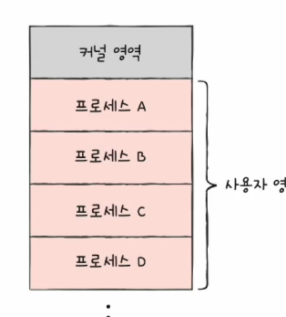
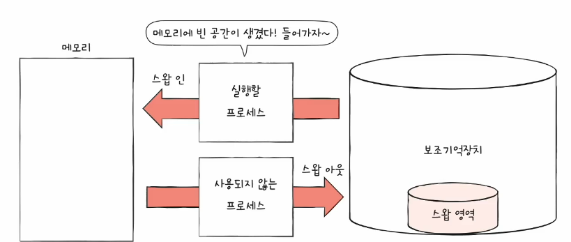
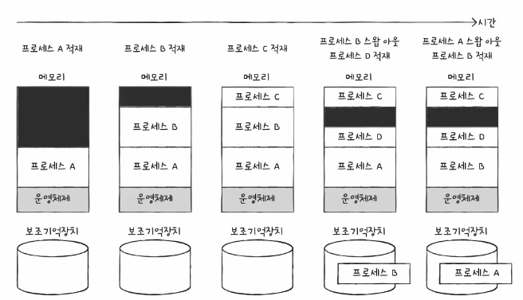
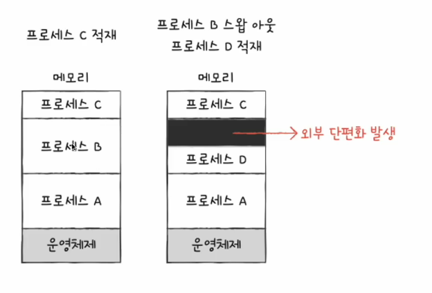

# 01. 연속 메모리 할당
- 얀속 메모리 할당 : 프로세스에 연속적인 메모리 공간을 할당

## 스와핑
- 현재 사용되지 않는 프로세스들을 보조기억장치의 일부 영역으로 쫓아내고
- 그렇게 생긴 빈 공간에 새 프로세스 적재하는 운영체제의 기본적인 메모리 관리 기능
- swap out : 당장 사용되지 않는 프로세스를 보조 기억 장치의 일부 영역(스왑 영역)으로 밀어내는 과정
- swap in : 스왑 영역에 있었던 프로세스가 다시 메모리로 적재되는 것

- 프로세스들이 요구하는 메모리 공간 크기보다 실제 메모리 크기가 커도 동시에 실행 가능!

- 스왑 영역 크기 확인하기 : free, top 명령어

## 매모리 할당
- 프로세스는 메모리의 빈 공간에 할당되어야 한다.
- 빈 공간 선택법 : 최초 적합, 최적 적합, 최악 적합

### 최초 적합 (first-fit)
- 운영체제가 메모리 내의 빈 공간을 순서대로 검색하다 적재할 수 있는 공간을 발견하면 그 공간에 프로세스를 배치하는 방식
- 검색 최소화, 빠른 할당

### 최적 척합 (best-fit)
- 운영체제가 빈 공간을 모두 검색해본 뒤, 적재 가능한 가장 작은 공간에 할당

### 최악 척합 (worst-fit)
- 운영체제가 빈 공간을 모두 검색해본 뒤, 적재 가능한 가장 큰 공간에 할당

## 외부 단편화
- 프로세스를 연속적으로 메모리에 활동하는 방식 -> 효율적으로 사용 X
- 외부 단편환(external fragmentation)이라는 문제 발생
- 프로세스들이 실행되고 종료되길 반복하며 메모리 사이 사이에 빈 공간 발생

> 외부 단편화 : 프로세스를 할당하기 어려울 만큼 작은 메모리 공간들로 인해 메모리가 낭비되는 현상

### 외부 단편화 해결
1. 메모리 합축 (compaction)
    - 여기저기 흩어져 있는 빈 공간들을 하나로 모으는 방식
    - 프로세스를 적당히 재비치 시켜 흩어져 있는 작은 빈 공간들을 하나의 큰 빈 공간으로 만드는 방법
    - 프로세스 재배치 과정 -> 오버헤드 야기
2. 가상 메모리 기법. 페이징