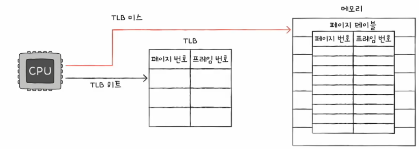

# 02. 페이징을 통한 가상 메모리 관리
- 연속 메모리 할당의 두 가지 문제점
  - 외부 단편화 -> 각기 다른 크시의 프로세스가 메모리에 연속적으로 할당되었기 때문
  - 물리 메모리보다 큰 프로세스 실행 불가
---
- 가상 메모리
  - 실행하고자 하는 프로그램을 일부만 메모리에 적재해서 실제 물리 메모리보다 큰 프로세스를 실행할 수 있게 하는 기술
  - 페이징, 세그멘테이션

## 페이징 (paging)
- 페이징
  - 프로셋의 논리 주소 공간을 페이지(page)라는 일정 단위로 자르고,
  - 메모리의 물리 주소 공간을 프레임(frame)이라는 페이지와 동일한 일정한 단위로 자른 뒤
  - 페이지를 프레임에 할당하는 가상 메모리 기법

- 페이징에서의 스와핑
  - 페이지 단위의 스왑 인(페이지 인), 스왑 아웃(페이지 아웃)
  - 메몰에 적재될 필교아 없는 페이지들은 보조 기억장치로 스왑 아웃
  - 실행헤 필요한 페이지들은 메모리로 스왑 인
  - 프로세스를 실행하기 위해 모든 페이지가 적재될 필요 X
  - 물리 메모리보다 큰 프로세스도 실핼될 수 있다!

## 페이지 테이블

- 페이지 테이블
  - (실제 메모리 내의 주소인) 물리 주소에 불연속적으로 배치되더라고
  - (CPU가 바라보는 주소인) 논리 주소에는 연속적으로 배치되도록 하는 방법
  - 페이지 번호와 프레임 번호를 짝지어 주는 일종의 이정표
  - 프로세스마다 페이지 테이블 존재
  - 물리적으로 분산되어 저장되어 있더라고 CPU 입장에서 바라본 논리 주소는 연속적
  - CPU는 그저 논리 주소를 순차적으로 실행하면 된다 !!

- 내부 단편화
  - 하나의 페이지 크기보다 작은 크기로 발생
    - 페이지 크기가 10KB, 프로세스 크기 108KB라면 2KB 내부 단편화 발생!

- 대형 페이지
  - 일부 운영체제에서 제공
  - 기본적으로 설정된 크기보다 훨씬 더 큰 페이지도 예외 페이지로 허용하는 경우가 있음!

## PTBR
- 프로세스마다 페이지 테이블 존재
- **프로세스 테이블 베이스 레지스터(PTBR)** : CPU내에 존재하며 각 프로세스의 페이지 테이블이 적재된 주소를 가리킨다.
- 단점 : 메모리 접근 시간 두배
  - 페이지 테이블 참조를 위해 한 번
  - 페이지 참조하기 위해 한 번

## TLB
- CPU 곁에 페이지 테이블의 캐시 메모리
- 페이지 테이블의 일부를 가져와 저장
- TLB 히트 : CPU가 접근하려면 논리 주소가 TLB에 존재 -> 메모리 접근 한 번
- TLB 미스 : CPU가 접근하려는 논리 주소가 TLB에 존재 X -> 메모리 접근 두 번

## 페이징에서의 주소 변환
- 특정 주소에 접근하고자 할 때 필요한 정보
  - 어떤 페이지/프레임에 접근하고 싶은지
  - 접근하려는 주소가 스 페이지 혹은 프레임으로부터 얼마나 떨어져 있는지

- 페이징 시스템에서의 놀리 주소
  - 페이지 번호(page number)와 변위(offset)
  - 

- <페이지 번호,변위>로 이루어진 논리 주소는 페이지 테이블을 통해 <프레임 번호, 변위>로 변환
  - 변위는 동일 : 프레임과 페이지를 동일한 크기로 나누었기 때문

- 페이지 테이블의 각각의 행 : 페이지 테이블 엔트리(PTE)
  - 페이지 번호, 프레임 번호
  - 유효 비트 : 현재 해당 페이지에 접근 가능한지 여부 -> 메모리에 적재되어 있는가 ?
  - 유효 비트가 0인 페이지에 접근
    - 페이지 폴드라는 인터럽트 발생
    - CPU는 기존의 작업 내역을 백업
    - 페이지 폴트 처리 루틴을 실행
    - 페이지 처리 루틴은 원하는 페이지를 메모리로 가져온 뒤 유효 비트를 1로 변경
    - 페이지 폴트를 처리했다면 CPU는 해당 페이지에 접근 할 수 있음

  - 보호 비트
    - 페이지의 보호 기능을 위해 존재하는 비트
    - 페이지에 접근할 권한을 제어함
  - 참조 비트
    - CPU가 이 페이지에 접근한 적이 있는지 여부
  - 수정 비트 (dirty bit)
    - CPU가 이 페이징 데이터를 쓴 적이 있는지 여부
    - 수정된 페이지는 스왑 아웃될 때 보조기억장치에도 쓰기 작업을 거쳐야 한다