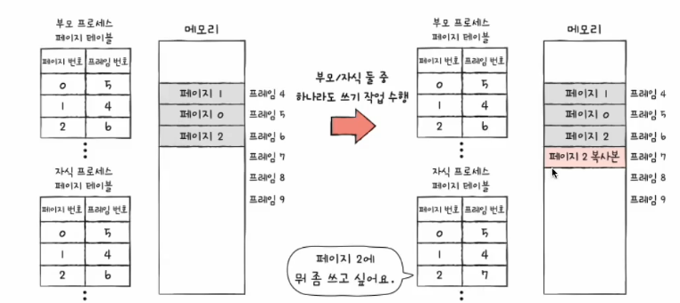
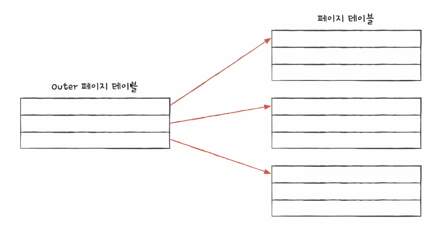

# 03. 쓰기 시 복사와 계층적 페이징
## 쓰기 시 복사
- 이론적인 fork()
  - 프로세스는 기본적으로 자원을 공유하지 않는다.
  - 부모 프로세스가 적재된 별도의 공간에 자식 프로세스가 통째로 복데되어 적재
  - 프로세스 생성 시간 지연, 메모리 낭비
- 쓰기 시 복사
  - 부모 프로세스와 동일한 자식 프로세스가 복제되어 생성되면
  - 자식 프로세스는 부모 프로세스와 동일한 프레임을 가리킴 (쓰기 작업 X -> 상태 유지)
  - 부모 프로세스 / 자식 프로세스 둘 중 하나가 페이지에 쓰기 작업 수행시 해당 페이지는 별도의 공간으로 복제
  - 프로세스 생성 시간 절약, 메모리 절약
  - 

## 계층적 페이징
- 프로세스 테이블의 크기는 생각보다 작지 않음
- 프로세스를 이루는 모든 페이지 테이블 엔트리를 메모리에 두는 것은 큰 낭비
- 프로세스를 이루는 모든 페이지 테이블 엔트리를 항상 메모리에 유지하지 않을 방법

### 계층적 페이징
- 페이지 테이블을 페이징하여 여러 단계의 페이지를 두는 방식
- 다단계 페이징

- 모든 페이지 테이블을 항상 메모리에 유지할 필요가 없어짐
  - CPU와 가장 가까이 위치한 페이지 테이블(Outer 페이지 테이블)은 항상 메모리에 유지

- 계층적 페이징을 이용하는 환경에서의 논리 주소
  - 