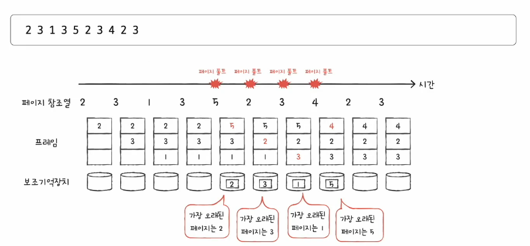
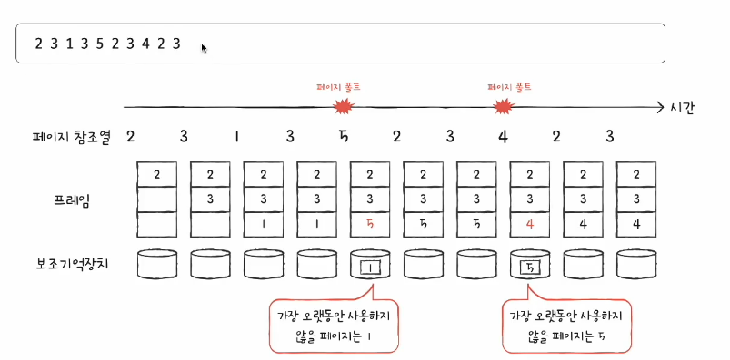
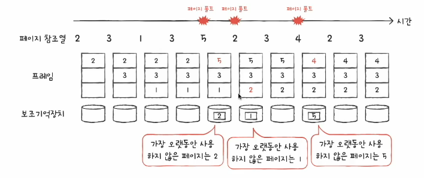
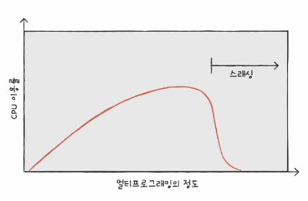
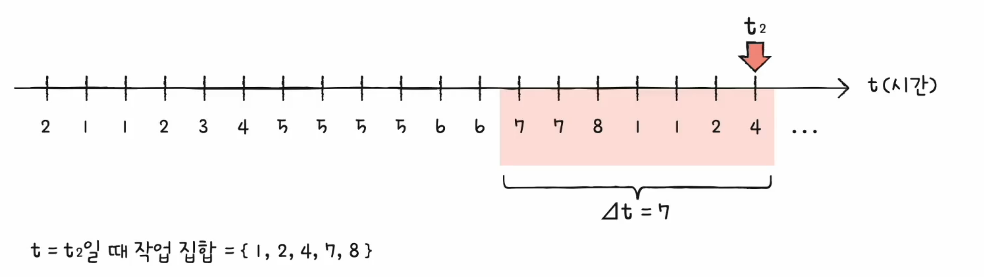
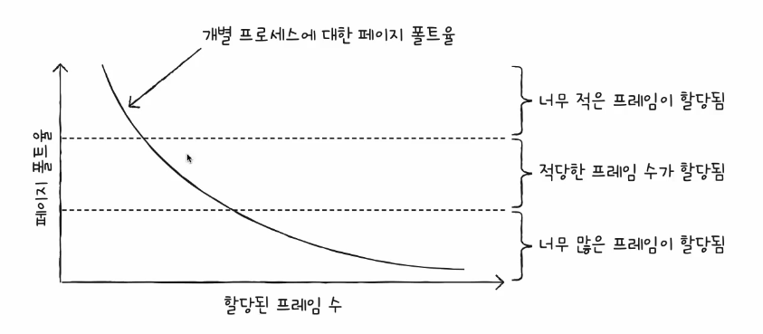

# 04 페이지 교체와 프레임 할당
- 물리 메모리가 한정적 -> 붚링효한 페이지 선별해 보조기억장치로 내보내고, 프로세스들에게 적잘한 수의 프레임 할당해야

## 요구 페이징
- 요구되는 페이지만 적재하는 기법
- 처음부터 모든 페이지를 적재하지 않고 필요한 페이지만을 메모리에 적재하는 기법

1. CPU가 특정 페이지에 접근하는 명령어를 실행한다.
2. 해당 페이지가 현재 메모리에 있을 경우 (유효 비트가 1일 경우) CPU는 페이지가 적재된 프레임에 접근한다.
3. 해당 페이지가 현재 메모리에 없을 경우 (유효 비트가 0일 경우) 페이지 폴트가 발생한다.
4. 페이지 폴트 처리 루팅느 해당 페이지를 메모리로 적재하고 유효 비트를 1로 설정한다.
5. 다시 1번 수행

- 순수 요구 페이징 : 프로세스 실행 시 어떠한 페이지도 적재하지 않은 채 실행하는 기법

## 페이지 교체 알고리즘
- 요구 페이징 기법으로 페이지들을 적재하다보면 언젠가 메모리가 가득 차게 된다.
- 당장 실행에 필요한 페이지를 적재하려면 보조기억장치로 내보낼 적재된 페이지를 결정하는 알고리즘
- 페이지 폴트가 적은 알고리즘이 좋은 알고리즘
  - 페이지 폴츠가 발생하면 보조기억장치에 접근해야 해서 성능 저하
- 페이지 참조열(page reference string)
  - CPU가 참조하는 페이즏ㄹ 중 연속된 페이지를 생략한 페이지열

### FIFO 페이지 교체 알고리즘
- 가장 단순한 방식
- 메모리에 가장 먼저 올라온 페이지부터 내쫓는 방식
- 프로그램 실행 내내 사용될 페이지도 쫒아낼 수 있어 효율적인 방식은 아님

### FIFO 페이지 교체 알고리즘 - 보완책
- 2차 기회(second-chance) 페이지 교체 알고리즘
- 참조 비트 1: CPU가 한 번 참조한 적이 있는 페이지 -> 한 번 더 기회 주기. 0으로 초기화 후 적재 시간을 현재 시간으로 설정
- 참조 비트 2: CPU가 참조한 적이 없는 이미지 -> 내쫒기

### 최적 페이지 교체 알고리즘
- CPU에 의해 참조되는 횟수를 고려
- 메모리에 오래 남아야 할 페이지는 **자주 사용될 페이지**
- 메모리에 없어도 될 페이지는 오랫동안 **사용하지 않을 페이지**
- 앞으로의 사용빈도가 가장 낮은 페이지를 교체하는 알고리즘 (가장 오랫동안 사용하지 않을)

- **가장 낮은 페이지 폴트율을 보장**하는 페이지 교체 알고리즘 
- 실제 구현이 어려움
- 다른 페이지 교체 알고리즘 성능을 평가하기 위한 하한선으로 간주

### LRU(Least-Recently-Used) 페이지 교체 알고리즘
- 가장 오래 사용되지 않은 페이지 교체

## 스레싱과 프레임 할당
- 페이지 폴트가 자주 발생하는 이유
  - 나쁜 페이지 교체 알고리즘을 사용해서
  - 프로세스가 사용할 수 있는 프레임 자체가 적어서 <- 근본적인 원인

- 스레싱
  - 프로세스가 실행되는 시간보다 페이징에 더 많은 시간을 소요하여 성능(CPU 이용률)이 저해되는 문제
  - 동시에 실행되는 프로세스의 수를 늘린다고 CPU 이용률이 높아지는 것이 아니다. 
  - 
  - 각 프로세스가 필요로 하는 최소한의 프레임 수가 보장되지 않았기 때문에 발생
  - **각 프로세스가 필요로 하는 최소한의 프레임 수를 파악하고 프로레스들에게 적절한 프로엠을 할당해주어야 한다.**

### 균등 할당(equal allocation)
- 가장 단순한 할당 방식
- 모든 프로세들에게 균등하게 프레임을 할당하는 방식

### 비례 할당(proportional allocation)
- 프로세스의 크기를 고려하자
- 프로세스 크기에 비례하여 프레임을 할당하는 방식
- 프로세스가 필요로 하는 프레임 수는 실행햐봐야 알 수 있음
  - 크기가 큰 프로세스라고 많은 프레임을 필요로 하지 않을 수 있고, 작은 프로세스가 많은 프레임을 필요로할 수 있다.

### 작업 집합 모델
- 프로세스가 실행하는 과정에서 배분할 프레임 결정
- 스레싱이 발생하는 이유는 빈번한 페이지 교체 때문
  - CPU가 특정 시간 동안 주로 참조한 페이지 개수만큼만 프레임을 할당하면 된다.
- 프로세스가 일정 기간동안 참조합 페이지 집합을 기억하여 빈번판 페이지 교체를 방식
  - 작업 집합 : 실행 중인 프로세스가 일정 시간 동안 참조한 페이지의 집합
- 작업 집합을 구하려면
  - 프로세스가 참조한 페이지와 시간 간격이 필요

### 페이지 폴트 빈도
- 프로세스가 실행하는 과정에서 배분할 프레임 결정
- 페이지 폴트율와 프레임 수는 반비례 한다!

- 프로세스가 실행하는 과정에서 배분할 프레임 결정
- 페이지 폴트율에 상한성과 하한성을 정하고, 그 내부 범위 안에서만 프레임을 할당하는 방식

동적 할당 방식 : 작업 집합 모델, 페이지 폴트 빈도