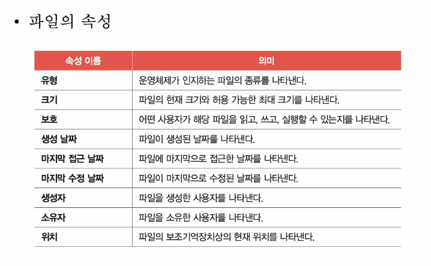
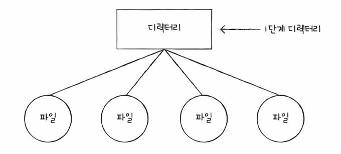

# 01. 파일과 디렉터리
- 파일 시스템 (file system)
  - 파일과 디렉터리를 관리하는 운영체제 내의 프로그램
  - 파일과 디렉터리를 다루어 주는 프로그램

- 파일과 디렉터리
  - 보조기억장치의 데이터 덩어리

## 파일
- 보조기억장치에 저장된 관련 정보의 집합
- 의미 있고 관련 있는 정보를 모은 논리적 단위
- 파일을 이루는 정보
  - 파일을 실행하기 위한 정보 + 부가 정보 (= 속성, 메타 데이터)

- 파일 연산을 위한 시스쳄 호출
  - 파일 생성
  - 파일 삭제
  - 파일 열기
  - 파일 닫기
  - 파일 읽기
  - 파일 쓰기 등

## 디렉터리
- 윈도에서는 폴더 (folder)
- 1단계 디렉터리
  - 
- 여러 계층으로 파일 및 폴더를 관리하는 트리 구조 디렉터리
  - 최상위 디렉터리(루트 디렉터리, /), 서브 디렉 터리
- 경로
  - 디렉터리를 이용해 파일/디렉터리의 위치, 나아가 이름까지 특정 지을 수 있는 정보
  - 같은 디렉터리에는 동일한 이름 파일 X. 서로 다른 디렉터리에는 동일한 이름 파일 O
  - 절대 경로 : 루트 디렉터리에서 자기 자신까지 이르는 고유한 경로
  - 상대 경로 : 현재 디렉터리에서 자기 자신까지 이르는 경로
- 디렉터리 연산을 위한 시스쳄 호출
  - 디렉터리 생성
  - 디렉터리 삭제
  - 디렉터리 열기
  - 디렉터리 닫기
  - 디렉터리 읽기 등
- 디렉터리 엔트리
  - 많은 운영체제에서는 그저 특별한 형태의 파일로 간주
  - 파일 내부에는 파일과 관련된 정보
  - 디렉터리 내부에는 해당 디렉터리에 담겨 있는 대상과 관련된 정보
  - 각 엔트리에 담기는 정보
    - 디렉터리에 포함된 대상의 이름
    - 대상이 보조기억 장치 내에 저장된 위치(를 유추할 수 있는 정보)