# 02. 파일 시스템
- 파일 시스템이 파일과 디렉터리를 보조기억장치에 할당하고 접근하는 방법
- 대표적인 파일 시스템의 종류(FAT 파일 시스템, 유닉스 파일 시스템) 학습

## 파티셔닝과 포매팅
- 이제 막 생산되어 한 번도 사용된 적 없는 하드디스크 / SSD
- 파티셔닝, 포메팅 하기 전까지는 사요할 수 없다.
---
- 파티셔닝
  - 저장 장치의 논리적인 영역을 구힉하는 작업
- 포매팅
  - 파일 시스템을 설정
  - 어떤 방식으로 파일을 관리할지 결정, 새로운 데이터를 쓸 준비하는 작업
  - 파일 시스템에는 여러 종ㄹ가 있고, 파티션 마다 다른 파일 시스템을 설정할 수도 있다.

포메팅까지 완료되어 파일 시스템을 설정했다면 파일과 디렉토리를 사용할 수 있다.

## 파일 할당 방법
- 포매팅까지 끝난 하드 디스크에 파일을 저장하기
- 운영체제는 파일/디렉터리를 블록 단위로 읽고 쓴다.
  - 즉, 하나의 파일이 보조기억장치에 저장될 때에는 여러 블록에 걸쳐 저장된다.
  - 하드 디스크의 가장 작은 단위인 섹터를 한 개 이상 묶어 블록 단위로 읽고 쓴다.
- 연속 할당, 불연속 할당 (연결 할당, 색인 할당)
- 오늘날엔 대부분 불연속 할당 사용

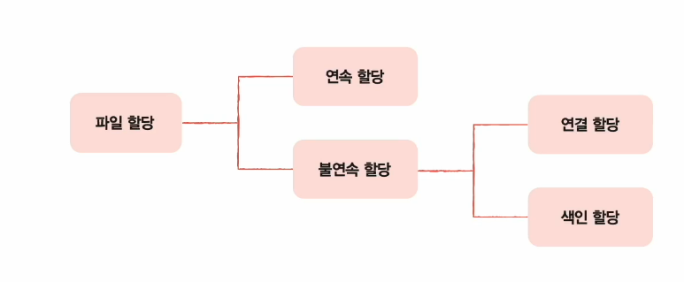

### 연속 할당
- 보조기억장치 내 연속적인 블록에 파일 할당
- 파일이 저장 장치 내에서 연속적인 공간을 차지하도록 블록을 할당하는 방법

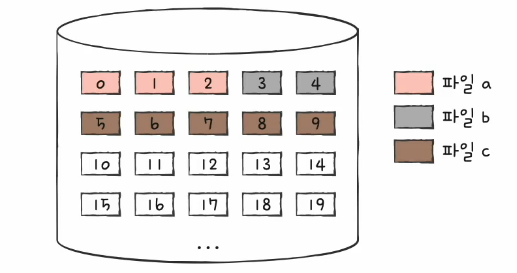

- 연속된 팡리에 접근하기 위해 파일의 첫 번째 블록 주소와 블록 단위의 길이만 알면 된다.
- 디렉터리 엔트리 : 파일 일 & 첫 번째 블록 주소 & 블록 단위 길이 명시

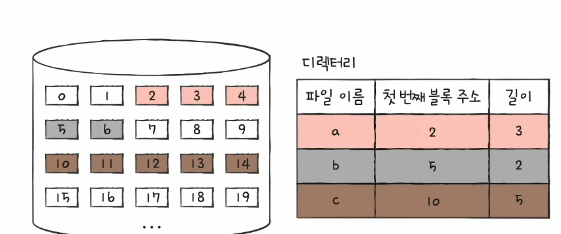

- 단점
  - 구현인 단순하지만 외부 단편화를 야기할 수 있다.

### 불연속 할당 - 연결 할당
- 각 블록의 일분에 다음 블록의 주소를 저장하여 각 블록이 다은 블록을 가리키는 형태로 할당
- 파일을 이루는 데이터 블록을 연결 리스트로 관리
- 불연속 할당의 일종 : 파일이 여러 블록에 흩어져 저장되어도 우방

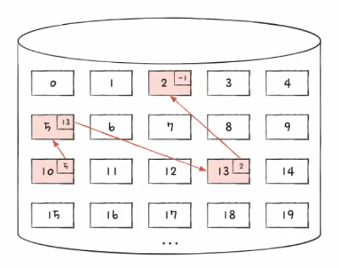

- 디렉터리 엔트리 : 파일이름 & 첫번째 블록 주소 $ 블록 단위의 길이
- 첫번째 블록 주소와 마지막 블록 주소를 기록할 수도 있음
- 블록의 끝이라면 특별한 표시자로 표시 

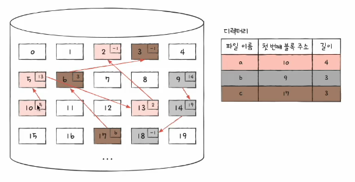

- 외부 단편화 해결
- 단점
  - 반드시 첫 번째 블록부터 하나씩 읽어들여야 한다.
  - 오류 발생 시 해당 블록 이후 블록은 접근이 어렵다.
  - 파일 임임의 위치 접근하는 속도가 매우 느리다.

### 불연속 할당 - 색인 할당
- 파일의 모든 블록 주소를 색인 블록이라는 하나의 블록에 모아 관리하는 방식 
  - 하나의 블록안에 어떤 주소에 접근해야 하는지 작성디어있음
- 파일 내 임의의 위치에 접근하기 용이

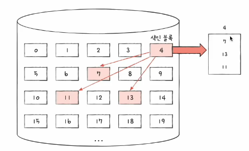

- 디렉터리 엔트리 : 파일 이름 & 색인 블록 주소

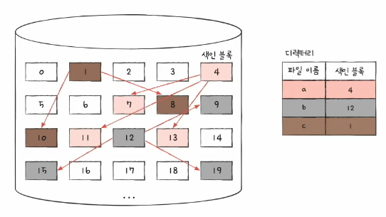

## 실제 사용하는 파일 시스템
### FAT 파일 시스템
- 연결 할당 기반 파일 시스템
- 연결 할당의 단점을 보완
  - 발생 근본적인 이유 : 모든 블록 안에 다음 번지 블록 주소 작성했기 때문
  - 하나라도 사용할 수 없으면 다음 찾을 수 없음
  - 보완 방안 : 각 블록에 포함된 다음 블록 주소를 한데 모아 테이블(FAT: File Allocation Table)로 관리
  - 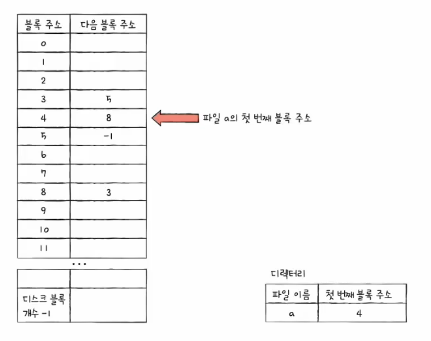
- FAT를 활용하는 파일 시스템

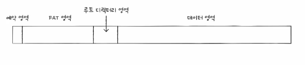

- 디렉터리 엔트리

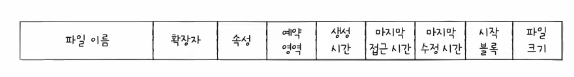

### 유닉스 파일 시스템
- 색인 할당 기반 파일 시스템
- 색인 블록 == i-node
  - 파일의 속성 저보와 15개의 블록 주소 저장 가능

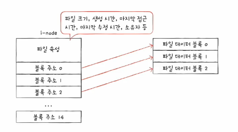

- i-node를 사용하는 파일 시스템

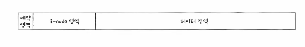

- 16개 블록 이상을 차지하는 파일의 경우
1. 블록 주소 중 12개에는 직접 블록 주소 저장
   - 직접 블록 : 파일 데이터가 저장된 블록
   - 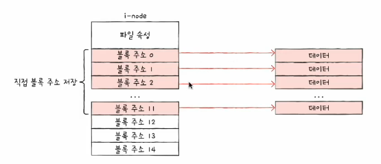
2. 1번으로 충분하지 안핟면 13번째 주소에 단일 간접 블록 주소 정장
   - 단일 간접 블록 : 파일 데이터를 저장한 블록 주소가 저장된 블록
   - 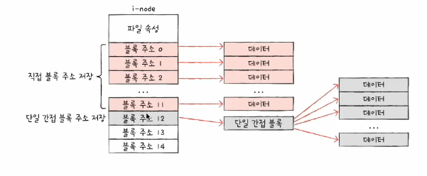
3. 2번으로 충분하지 않다면 14번째 주소에 이중 간접 블록 주소 저장
   - 이중 간접 블록 : 단일 간접 블록들의 주소를 저장하는 블록
   - 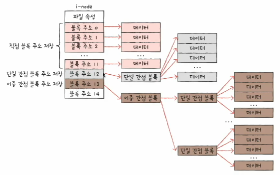
4. 3번으로 충분하지 않다면 15번째 주소에 삼중 간접 블록 주소 저장
   - 삼중 간접 블록 : 이중 간접 블록들의 주소를 저장하는 블록
   - 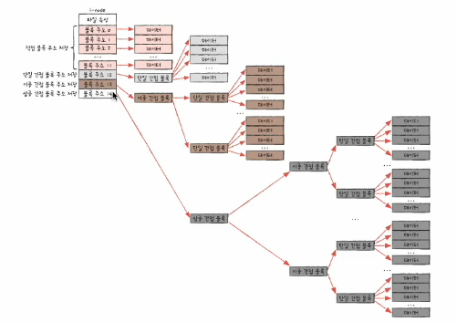

